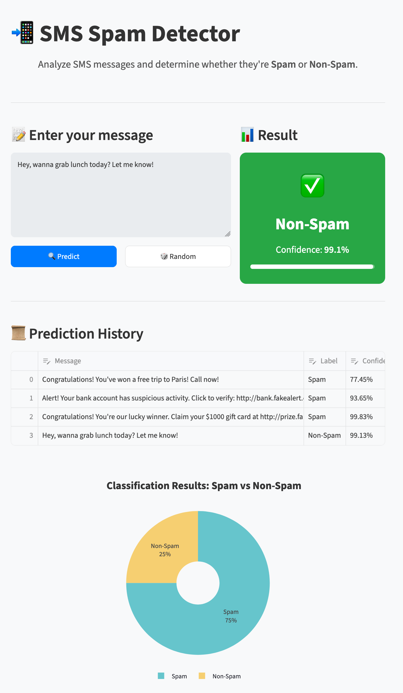

# SMS Spam Detector

## Overview

This project is a **Streamlit application** that detects whether an SMS message is spam or non-spam using a pre-trained deep learning model. The model was trained on SMS data and uses natural language processing techniques for prediction. The application provides an intuitive interface for users to input messages and view predictions.



## Features

- **Interactive Interface:** Enter SMS messages to classify them as spam or non-spam.
- **Real-time Predictions:** Displays the predicted label along with the confidence score.
- **Visualization:** Pie chart showing the proportion of spam vs non-spam predictions.
- **Prediction History:** Maintains a log of all predictions made during the session.
- **Custom Styling:** User-friendly interface with CSS enhancements.

## Demo

You can try the application live:

- **Docker Deployment on Hugging Face Spaces:** [SMS Spam Detector - Docker](https://cnoret-sms-spam-detector.hf.space/)
- **Streamlit Cloud Deployment:** [SMS Spam Detector - Streamlit](https://sms-spam-detector-cnoret.streamlit.app/)

## Disclaimer

This model was trained on the [UCI SMS Spam Collection dataset](https://archive.ics.uci.edu/ml/datasets/sms+spam+collection), which contains approximately **5,500 messages** (~13% spam, ~87% non-spam). While sufficient for a learning project, this dataset has significant limitations that affect real-world reliability:

- **Small size:** 5,500 samples is far below what production spam filters use (millions of examples).
- **Class imbalance:** The heavy majority of non-spam examples can bias the model toward predicting "non-spam" by default.
- **Outdated language:** The dataset dates from the early 2010s and does not reflect modern spam patterns, URLs, or phrasing.
- **English only:** The model has no generalization capability for other languages.

**This application is intended for educational and demonstration purposes only.** Do not use it as a reliable spam filter in a production environment.

## Installation

### Prerequisites

- [Docker](https://www.docker.com/get-started) installed on your machine

### Steps

1. Clone the repository:

   ```bash
   git clone https://github.com/cnoret/sms-spam-detector.git
   cd sms-spam-detector
   ```

2. Build the Docker image:

   ```bash
   docker build -t sms-spam-detector .
   ```

3. Run the container:

   ```bash
   docker run -p 7860:7860 sms-spam-detector
   ```

4. Access the app in your browser at `http://localhost:7860`.

## Project Structure

```text
├── app.py                # Main Streamlit application
├── models/               # Directory for the model and tokenizer
│   ├── model_wordembed.keras
│   └── tokenizer_word_index.npy
├── notebook/             # Jupyter notebook (training & exploration)
├── Dockerfile            # Docker configuration
├── requirements.txt      # Python dependencies
└── README.md             # Project documentation
```

## Example Usage

1. Start the application with Docker (see [Installation](#installation)).
2. Enter a message in the text box.
3. Click the "Predict" button to view the classification result.
4. Check the visualization for the proportion of predictions.

## Technologies Used

- **Framework:** [Streamlit](https://streamlit.io/)
- **Machine Learning:** TensorFlow, Keras
- **Visualization:** Plotly
- **NLP:** Tokenizer, Embedding layers

## Future Enhancements

- Add support for additional languages.
- Include training scripts for fine-tuning the model.
- Enhance visualizations with detailed analytics.
- Allow users to choose between multiple pre-trained models within the application.

## Author

**Christophe Noret**
[](https://www.linkedin.com/in/christophenoret/)

## License

This project is licensed under the MIT License - see the [LICENSE](LICENSE) file for details.

### Dependencies Licenses

- **Streamlit:** Licensed under the Apache 2.0 License. For details, see [Streamlit's GitHub repository](https://github.com/streamlit/streamlit/blob/develop/LICENSE).
- **TensorFlow:** Licensed under the Apache 2.0 License. For details, see [TensorFlow's license](https://github.com/tensorflow/tensorflow/blob/master/LICENSE).
- **Plotly:** Licensed under the MIT License. For details, see [Plotly's GitHub repository](https://github.com/plotly/plotly.py/blob/master/LICENSE.txt).
